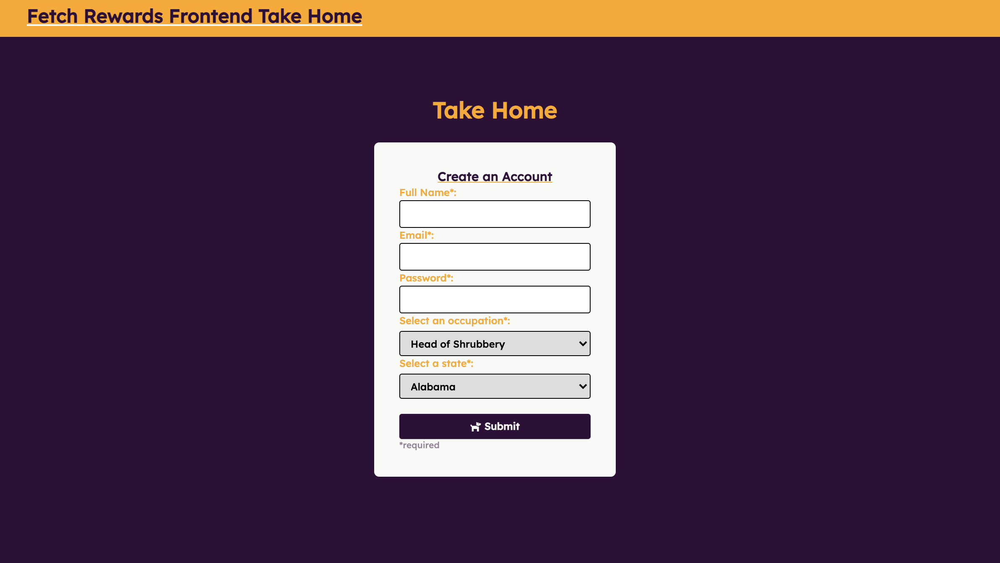

# Fetch Take Home (Frontend)

React form with inputs and dropdowns made for Fetch Rewards.

### General Info

Fetch Take Home is a form made with react. Users can type in their name, email, password. Occupations and states can be entered by using the available dropdowns.

### Themes and Styling

This react app uses Lexand font from Google fonts and the main colors are orange and purple to march Fetch Rewards' color scheme. Additional styling information can be found in the tailwind.config.js

## Available Scripts

In the project directory, you can run:

### `npm start`

Runs the app in the development mode.\
Open [http://localhost:3000](http://localhost:3000) to view it in your browser.

The page will reload when you make changes.\
You may also see any lint errors in the console.

## Languages and Packages used

- React
- Tailwind
- Axios
- Font Awesome

### Screenshot

### Future Features

- Improved password input
- Robust Form Validation
- A module or proper alert for success or errors

# Fetch
